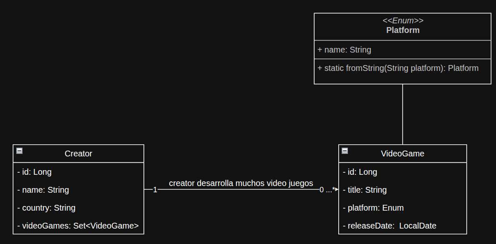
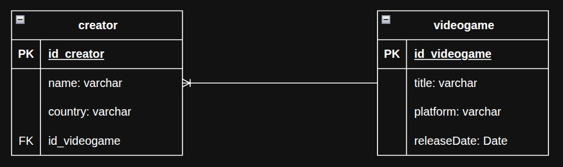

# video-games-DevOps
Repositorio para practica integración continua y despliegue continuo con Microsoft Azure.

### Descripción
Este proyecto constará únicamente de 2 tablas en la base de datos. Creadores y Videojuegos
La base de datos a usar es H2 (base de datos en memoria).
El principal objetivo de este proyecto será el de realizar una integración continua con el pipeline en Azure
para realizar la compilación, la ejecucion de los test y la creación del archivo empaquetado .jar CI/CD.
Luego se procedera a crear su despliegue en los diferentes ambientes de trabajo como ambiente de producción, stage y test.

### 🛠️ ¿Qué funcionalidades tendrá?
#### CRUDs:

- Crear/editar/eliminar desarrolladoras

- Crear/editar/eliminar videojuegos (asociándolos a una desarrolladora)

- Listar videojuegos agrupados por desarrolladora (vista opcional, pero muy útil).

### 💡 Extras opcionales (funcionalidad futura):

- Filtrar videojuegos por plataforma

- Mostrar detalles de cada videojuego en una página individual

- Validaciones de formularios (ej: fechas válidas, campos requeridos)

- Paginación (si hay muchos registros)

## 🛠️ Diagramas

### *1. Diagrama de Clases*


### *2. Diagrama Entidad Relación*



## 🧠 Notas de Lógica y Aprendizaje
#### ✅ Método update() en VideoGameService

Este método fue retador. Se trataba de actualizar los datos de un videojuego, y mantener sincronizada la relación bidireccional con su Creator.

Pasos que seguí:

1. Buscar el VideoGame en base al id proporcionado.

2. Buscar el nuevo Creator por su id (lanzar excepción si no existe).

3. Actualizar campos simples (title, platform, releaseDate).

4. Comparar el Creator actual y el nuevo:
   - Si es el mismo, guardar sin modificar la relación.

   - Si es diferente:
        -   Quitar el videojuego del oldCreator.
        -   Agregarlo al newCreator.
        - Asignar el nuevo creador al videoGame.

Esto evita inconsistencias en la relación bidireccional.

#### ✅ Método save() en VideoGameService

Pasos importantes:

1. Validar que el Creator exista, si no, lanzar excepción.

2. Validar si ya existe un videojuego con ese título + plataforma:

   - Si existe, lanzar excepción.

   - Esto evita duplicados innecesarios.

3. Sincronizar la relación:

   - Usar creator.addVideoGame(videoGame) para mantener coherencia bidireccional.

    - Asignar el creator al videoGame.

### ✅ Agrupar videojuegos por Creator (Proyección)

Proyecciones en Spring Data JPA. En lugar de traer entidades completas, usé una interfaz con getters que mapean directamente los resultados de una consulta nativa.

Pasos:

1. Crear la proyección con los campos necesarios: creatorName, title, platform, etc.

2. Hacer una consulta nativa con alias, que devuelve los campos seleccionados.

3. En el servicio, agrupar los resultados usando Collectors.groupingBy(...).

Esto ayuda a optimizar rendimiento y traer solo la información necesaria, especialmente útil en listados grandes.

### 🧪 Manejo del método ```delete()``` y error ```ConcurrentModificationException```
🧹 Contexto

Durante la implementación del método ```delete(Long id)``` en el ```CreatorService```, fue necesario eliminar a
un ```Creator``` junto con la relación bidireccional que mantiene con sus ```VideoGames```.

El modelo estaba definido con una relación bidireccional como:

    @OneToMany(mappedBy = "creator", cascade = CascadeType.ALL, orphanRemoval = true)
    private Set<VideoGame> videoGames;

Por lo tanto, antes de eliminar un Creator, es necesario **remover manualmente los videojuegos de su colección** para mantener la consistencia de la relación y evitar referencias huérfanas.

#### ❌ Error: ```ConcurrentModificationException```

El intento inicial de eliminar los videojuegos asociados se realizó con este fragmento:

    creatorDb.getVideoGames().forEach(creatorDb::removeVideoGame);


Este código arrojó:

    java.util.ConcurrentModificationException

#### 🧠 ¿Por qué ocurre?

El error no tiene que ver con concurrencia multihilo, como podría parecer. Se produce porque estás modificando la colección (removeVideoGame) mientras la recorres con forEach(...), lo que invalida el iterador interno de la colección.

##### ✅ Solución aplicada

Se creó una **copia segura** de la colección usando ```new ArrayList<>(...)```, y luego se iteró sobre esa lista para modificar la original:

    List<VideoGame> videoGames = new ArrayList<>(creatorDb.getVideoGames());
    for (VideoGame videoGame : videoGames) {
    creatorDb.removeVideoGame(videoGame);
    }


Esto evita el error porque no estás iterando sobre la misma colección que estás modificando.

##### ✅ Test de eliminación

Se cubrió esta lógica con un test de unidad que:

1. Verifica que se llama a creatorRepository.delete(...).

2. Verifica que la colección de videojuegos del ```Creator``` queda vacía tras la operación.


    @Test
    void shouldDeleteCreatorSuccessfullyTest() {
    Long id = 1L;
    Creator creatorToDelete = DataMock.creatorMock();
    
        when(creatorRepository.findById(id)).thenReturn(Optional.of(creatorToDelete));
    
        creatorService.delete(id);
    
        verify(creatorRepository).delete(creatorToDelete);
        assertEquals(0, creatorToDelete.getVideoGames().size());
    }


También se implementó un test usando ```ArgumentCaptor``` para capturar el objeto ```Creator``` final antes de ser eliminado y asegurarse de que su lista de videojuegos esté vacía:

    @Captor
    private ArgumentCaptor<Creator> creatorArgumentCaptor;
    
    @Test
    void shouldDeleteCreatorSuccessfullyWithArgumentCaptorTest() {
    Long id = 1L;
    Creator creatorToDelete = DataMock.creatorMock();
    
        when(creatorRepository.findById(id)).thenReturn(Optional.of(creatorToDelete));
    
        creatorService.delete(id);
    
        verify(creatorRepository).delete(creatorArgumentCaptor.capture());
        Creator captured = creatorArgumentCaptor.getValue();
    
        assertEquals(0, captured.getVideoGames().size());
    }

##### 📘 Lección aprendida

* El error ```ConcurrentModificationException``` no siempre es por concurrencia, a veces es por modificar una colección mientras se itera.

* En relaciones bidireccionales, **mantener la consistencia entre entidades antes de operaciones de persistencia** es clave.

* Usar estructuras como ```Set<>``` puede ayudar a evitar duplicados innecesarios en asociaciones.